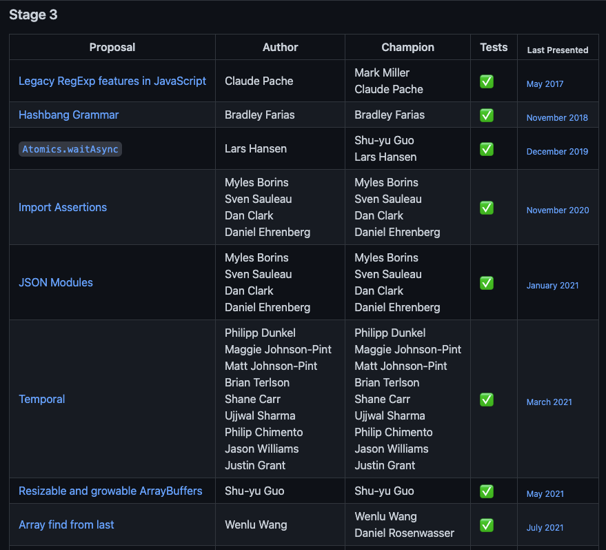

<style>
  img{
    max-height: 25vh;
margin: auto;
display: block;
  }

  section>p:first-child:last-child>img:first-child:last-child{
    max-height: 50vh;
  }
</style>

# The Road to JSON Import Support in Node.js

by Antoine du Hamel  
[@aduh95](https://github.com/aduh95) on GitHub

---

## About me

- Node.js TSC member since April 2021
- Software Engineer by day at Transloadit

Email me at <antoine@transloadit.com> if you'd like your work on Node.js core to
be sponsored by Transloadit. We're hiring:

- $50/hour, 30hrs/week, 20% to work on Node.js core.
- Check out https://transloadit.com/jobs/.

---

## JSON modules, what are they?

A handy way to interact JSON files from your JS code.

1. History of JSON Modules
2. How to use them _today_
3. What's next?

---

## History of JSON modules in the JS ecosystem

### CommonJS (CJS)

- CommonJS is the "classic" way Node.js modules are used (`require()`,
  `module.exports`, etc.)
- Has support for `require('./file.json')`.
- Is not supported in browsers.


[proposal to add requiring of json files]:
  https://github.com/nodejs/node-v0.x-archive/issues/1357
[commit that adds json support to `require()`]:
  https://github.com/nodejs/node/commit/588d885e81dec667920383ac7246daceeb7f99fd

---

## History of JSON modules in the JS ecosystem

### ECMAScript modules (ESM)

- Part of the ES6/ES2015 spec.
- Use `import` and `export` keywords.
- Allows to write modular JavaScript code cross-platform (Node.js 12+, browsers,
  Deno, TypeScript, etc.).
- Only supports JS modules at first.

[pr adding javascript modules to the html spec]:
  https://github.com/whatwg/html/pull/443

---

## History of JSON modules in the JS ecosystem

### Node.js ESM implementation

- A first implementation landed in Node.js v8.5.0
  - Very experimental
  - Mimicking the CJS loader mechanisms
  - 

[pr introducing esm in node.js with json support]:
  https://github.com/nodejs/node/pull/14369
[pr introducing json modules to node.js esm]:
  https://github.com/nodejs/node/commit/b1094dbe19f31f7a69ad16d193748f610b159073

---

## History of JSON modules in the JS ecosystem

### 1st tentative: change the HTML spec


[json modules original proposal]: https://github.com/whatwg/html/issues/4315
[json modules pr]: https://github.com/whatwg/html/pull/4407

---

## History of JSON modules in the JS ecosystem

### 1st tentative: change the HTML spec


_It was reverted 5 months later._

[proposal to revert]: https://github.com/WICG/webcomponents/issues/839
[revert pr]: https://github.com/whatwg/html/pull/4943

---

### 1st tentative: change the HTML spec

Reasons:

```js
import weatherData from "https://totally-trustworthy.api.com/UK/London.json";

console.log(weatherData);
```

```json
{
  "12am": { "temperature": "273.25", "relativeHumidity": "100" },
  "1am": {}
}
```

```js
fetch("https://totally-trustworthy.api.com/storeUserData", {
  method: "POST",
  body: JSON.stringify(localStorage),
});

export default {
  "12am": { temperature: "273.25", relativeHumidity: "100" },
  // etc.
};
```

---

## History of JSON modules in the JS ecosystem

### 2nd tentative: change the JS language

```js
import weatherData from "https://totally-trustworthy.api.com/UK/London.json" assert { type: "json" };

console.log(weatherData);
```


[import assertions tc39 proposal]:
  https://github.com/tc39/proposal-import-assertions

---

## History of JSON modules in the JS ecosystem

### 2nd tentative: change the JS language

#### TC39 proposals

- Ecma TC39 committee authors ES spec.
- Proposal is stage 3 (final stage before inclusion in the official spec).
- Visit https://github.com/tc39/proposals to have a glance at the future of JS.

[tc39 process document]: https://tc39.es/process-document/

---



---


---

## JSON modules today

### Node.js and web compatibility

```
ECMAScript spec (TC39)
        ^
        |
  HTML spec (WHATWG)
        ^
        |
Node.js ESM implementation
```

---

## JSON modules today

### Example of when Node.js follows the HTML spec

```js
const [moduleA, moduleB] = await Promise.allSettled([
  import("https://example.com", { assert: { type: "css" } }),
  import("https://example.com", { assert: { type: "json" } }),
]);
```

- ECMAScript does not define how this should behave except that it must not be
  possible that both promises resolve successfully.
- The HTML spec defines a list of instruction on how to handle this.
- Node.js had adopted the HTML spec to ensure compatibility with the rest of the
  ecosystem.

---

## JSON modules today

### Current support

- ✅ Node.js v17.5+ (and v16.14+ with `--experimental-json-modules` CLI flag)
- ✅ TypeScript v4.5+
- ✅ Deno v1.17+
- ✅ Chromium 91+
- ❌ Firefox
- ❌ Safari
- ❌ Bundlers

---

## JSON modules today

### How to use them

```js
import packageJson from "./package.json" assert { type: "json" };
```

and with dynamic imports:

```js
const packageJson = await import("./package.json", {
  assert: { type: "json" },
});
```

---

## JSON modules today

### How to use them

```js
// This DOES NOT work:
import { version } from "./package.json" assert { type: "json" }; // Throws

// This does:
import packageJson from "./package.json" assert { type: "json" };
const { version } = packageJson;
```

---

## What's next?

The ball is on your court:

- Test it, play with it!
- Don't hesitate to open issues and PRs.
- Beyond web compatibility:
  - YAML modules?
  - TOML modules?
  - TypeScript imports.

---

## That's all folks!

**Thanks for tunning in.**
